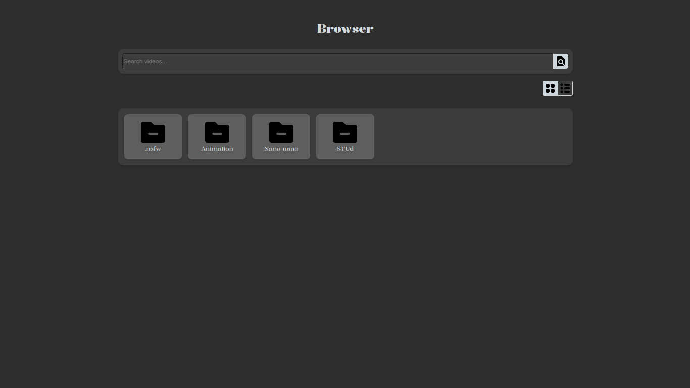
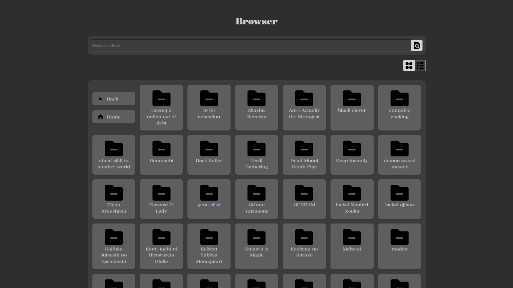

# Video Streaming Flask App

This project is a Flask application for streaming videos from a specified directory. It provides an API to retrieve the directory structure, play videos, and get related videos within a folder.

## Table of Contents

- [Features](#features)
- [Installation](#installation)
- [Configuration](#configuration)
- [Usage](#usage)
- [API Endpoints](#api-endpoints)
- [Template Details](#template-details)
- [Caching](#caching)
- [Demo](#demo)
- [License](#license)
- [Acknowledgements](#acknowledgements)

## Features

- List video files in a specified directory.
- Stream video files through a web interface.
- Extract and serve subtitles for `.mkv` files.
- Provide related videos within the same folder.
- Basic caching for improved performance.

## Installation

1. **Clone the repository:**

    ```bash
    git clone https://github.com/yourusername/video-streaming-flask-app.git
    cd video-streaming-flask-app
    ```

2. **Create and activate a virtual environment:**

    ```bash
    python3 -m venv venv
    source venv/bin/activate
    ```

3. **Install the required dependencies:**

    ```bash
    pip install -r requirements.txt
    ```

4. **Ensure `ffmpeg` is installed:**

    ```bash
    sudo apt-get install ffmpeg
    ```

## Configuration

1. Rename the `config.ini.example` to `config.ini`

2. Update the `VIDEO_DIR` to point to your video directory

## Usage

1. **Run the Flask application:**

    ```bash
    python app.py
    ```

2. **Open your web browser and navigate to:**

    ```
    http://127.0.0.1:5000
    ```

## API Endpoints

- **GET /**

    Renders the main index page.

- **GET /api/structure**

    Returns the directory structure of the video directory.

    **Example Response:**
    ```json
    [
        {"type": "folder", "name": "example_folder", "path": "example_folder"},
        {"type": "file", "name": "example_video.mp4", "path": "example_folder/example_video.mp4"}
    ]
    ```

- **GET /play/<filename>**

    Renders the video playback page for the specified video file.

- **GET /video/<filename>**

    Serves the specified video file.

- **GET /api/related-videos?folder=<folder>**

    Returns related videos within the specified folder.

    **Example Response:**
    ```json
    [
        {"name": "related_video1.mp4", "path": "example_folder/related_video1.mp4"},
        {"name": "related_video2.mkv", "path": "example_folder/related_video2.mkv"}
    ]
    ```

## Template Details

- **index.html:**
  - Main landing page.
  - Fetches and displays the directory structure.

- **video.html:**
  - Video playback page.
  - Streams the selected video and displays subtitles if available.

## Caching

This application uses `Flask-Caching` to cache the directory structure and related videos to improve performance. The cache timeout is set to 300 seconds (5 minutes).

## Demo





## License

This project is licensed under the MIT License. See the [LICENSE](LICENSE) file for details.

## Acknowledgements

- [Flask](https://flask.palletsprojects.com/)
- [Flask-Caching](https://flask-caching.readthedocs.io/)
- [FFmpeg](https://ffmpeg.org/)
